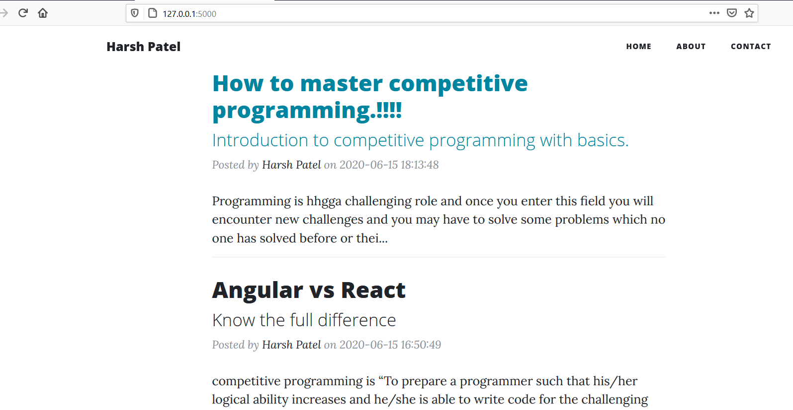
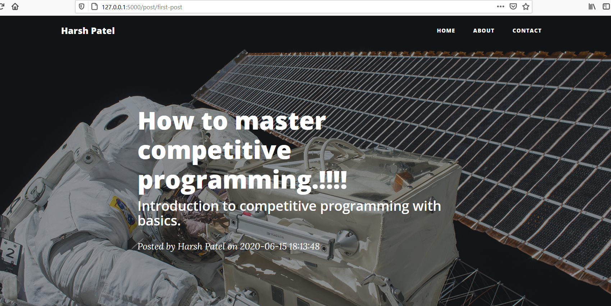
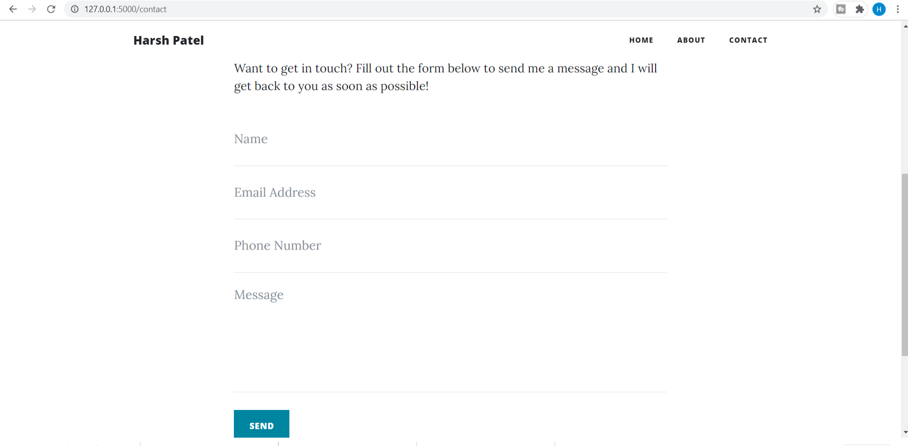

# Python-Flask-Blog-Project-
Blogging website is a project which i developed using Flask and python.
The website allows you to post your daily blog and content on the website.
There is an admin panel also available from where you can Add, Delete, Edit 
your post and also receive queries and suggestion from users.
